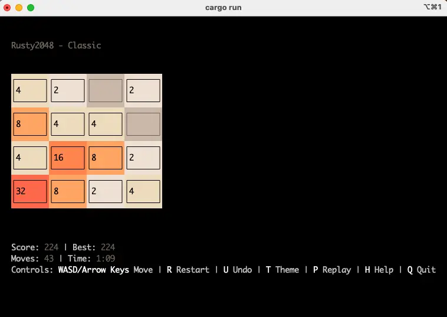
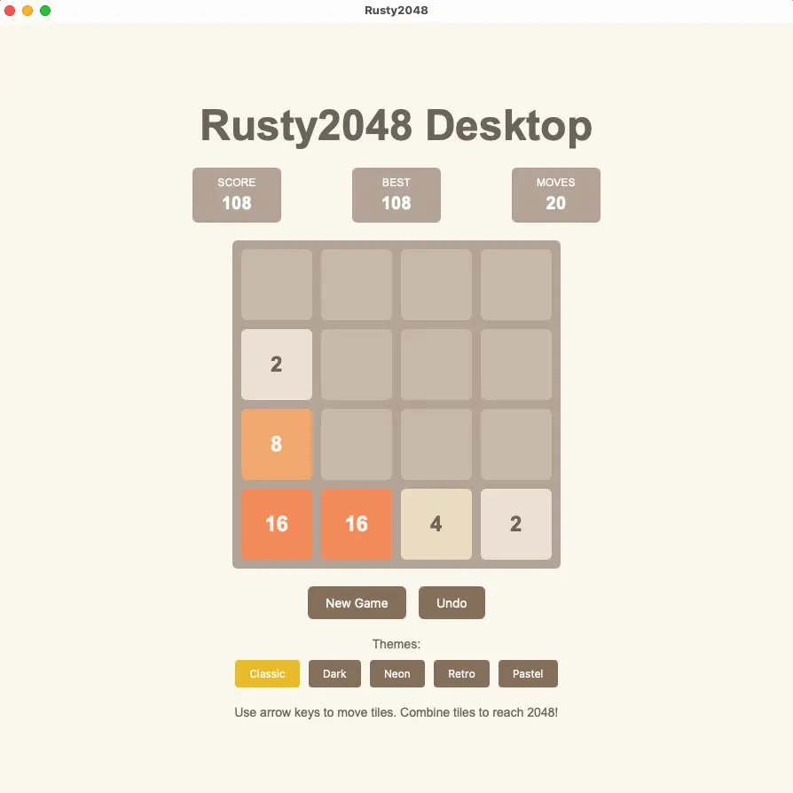
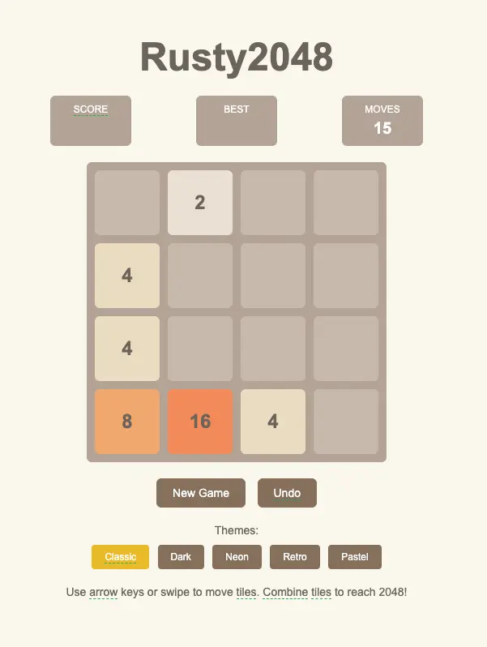

# 🎮 Rusty2048

<div align="center">

**A high-performance, cross-platform 2048 game implementation built with Rust**

[](https://github.com/soladdev/rusty2048/actions?query=workflow%3ACI)
[](https://github.com/soladdev/rusty2048/workflows/Quick%20Check/badge.svg)
[](https://opensource.org/licenses/MIT)
[](https://www.rust-lang.org/)

[🌐 Play Online](https://rusty2048.vercel.app) • [📖 Documentation](docs/) • [🐛 Report Bug](https://github.com/soladdev/rusty2048/issues) • [💡 Request Feature](https://github.com/soladdev/rusty2048/issues)

</div>

---

## 📋 Table of Contents

- [About](#-about)
- [Features](#-features)
- [Screenshots](#-screenshots)
- [Quick Start](#-quick-start)
- [Installation](#-installation)
- [Usage](#-usage)
- [Platforms](#-platforms)
- [Development](#-development)
- [Roadmap](#-roadmap)
- [Contributing](#-contributing)
- [Contact](#-contact)
- [License](#-license)

---

## 🎯 About

**Rusty2048** is a modern, high-performance implementation of the classic 2048 puzzle game. Built entirely in Rust, it delivers exceptional performance across multiple platforms while maintaining a clean, maintainable codebase.

### Why Rusty2048?

- ⚡ **Blazing Fast**: Leverages Rust's zero-cost abstractions for optimal performance
- 🎨 **Beautiful UI**: Smooth animations and modern design across all platforms
- 🌍 **Cross-Platform**: Play on CLI, Web, or Desktop with a consistent experience
- 🤖 **AI-Powered**: Watch intelligent algorithms play or learn from them
- 📊 **Analytics**: Track your progress with comprehensive statistics
- 🔧 **Highly Customizable**: Multiple themes, languages, and configuration options

---

## ✨ Features

### Core Gameplay
- ✅ Classic 2048 gameplay with smooth tile animations
- ✅ Undo functionality for strategic gameplay
- ✅ Score tracking with best score persistence
- ✅ Configurable board size and target score
- ✅ Game state persistence and auto-save

### Advanced Features
- 🤖 **AI Mode**: Three intelligent algorithms (Greedy, Expectimax, MCTS) with auto-play
- 🎨 **Theme System**: 5 beautiful themes (Classic, Dark, Neon, Retro, Pastel)
- 🌐 **Internationalization**: Full support for English and Chinese
- 📊 **Statistics**: Comprehensive game analytics with visual charts (CLI)
- 🔄 **Replay System**: Record and replay game sessions (CLI)
- 📱 **PWA Support**: Install as a native app with offline capability (Web)

### Platform-Specific
- **CLI**: Full-featured terminal UI with charts, replays, and AI mode
- **Web**: Progressive Web App with responsive design and touch support
- **Desktop**: Native desktop application built with Tauri

> 📖 For detailed feature documentation, see [FEATURES.md](docs/FEATURES.md)

---

## 🖼️ Screenshots

<div align="center">

| CLI Version | Desktop Version | Web Version |
|:----------:|:---------------:|:-----------:|
|  |  |  |

</div>

---

## 🚀 Quick Start

### Play Online (Easiest)

Visit **[rusty2048.vercel.app](https://rusty2048.vercel.app)** to play instantly in your browser. No installation required!

### Install CLI Version

**One-line installation:**
```bash
curl -fsSL https://raw.githubusercontent.com/soladdev/rusty2048/main/scripts/install.sh | bash
```

**Or download pre-built binaries:**
- Visit [GitHub Releases](https://github.com/soladdev/rusty2048/releases)
- Download for your platform (Linux, macOS, Windows)
- Extract and run the binary

---

## 📦 Installation

### CLI Version

#### Option 1: Installation Script (Recommended)
```bash
curl -fsSL https://raw.githubusercontent.com/soladdev/rusty2048/main/scripts/install.sh | bash
```

#### Option 2: Pre-compiled Binaries
Download from [GitHub Releases](https://github.com/soladdev/rusty2048/releases) for your platform.

#### Option 3: Build from Source
```bash
git clone https://github.com/soladdev/rusty2048.git
cd rusty2048
cargo build --release -p rusty2048-cli
```

### Web Version

**Play Online:** [rusty2048.vercel.app](https://rusty2048.vercel.app)

**Build Locally:**
```bash
git clone https://github.com/soladdev/rusty2048.git
cd rusty2048/web
./build.sh
# Serve the dist folder with any static file server
```

### Desktop Version

**Build from Source:**
```bash
git clone https://github.com/soladdev/rusty2048.git
cd rusty2048/desktop
cargo tauri build
```

> 📖 For detailed build instructions, see [BUILD_GUIDE.md](docs/BUILD_GUIDE.md)

---

## 🎮 Usage

### Basic Controls

| Action | CLI | Web/Desktop |
|--------|-----|-------------|
| Move Tiles | Arrow Keys / WASD | Arrow Keys / WASD / Swipe |
| New Game | `R` | Click "New Game" |
| Undo | `U` | Click "Undo" |
| Change Theme | `T` or `1-5` | Click Theme Buttons |
| Switch Language | `L` | Click Language Button |
| Quit | `Q` or `ESC` | Close Window |

### Advanced Features (CLI)

- **AI Mode**: Press `I` to toggle AI, `O` for auto-play
- **Replay System**: Press `P` to enter replay mode
- **Statistics**: Press `C` to view game analytics
- **Help**: Press `H` for theme help

> 📖 For complete controls documentation, see [FEATURES.md](docs/FEATURES.md#-controls)

---

## 💻 Platforms

### Command Line Interface (CLI)
- **Best for**: Developers, terminal enthusiasts, advanced features
- **Features**: Full AI mode, replay system, statistics charts
- **Requirements**: Terminal emulator

### Web Application
- **Best for**: Casual players, mobile users, quick access
- **Features**: PWA support, offline play, responsive design
- **Requirements**: Modern web browser

### Desktop Application
- **Best for**: Native desktop experience
- **Features**: Native performance, system integration
- **Requirements**: Tauri runtime

---

## 🛠️ Development

### Prerequisites

- **Rust**: 1.70 or higher
- **Cargo**: Rust's package manager (included with Rust)
- **Node.js**: 20+ (for web version)
- **System Dependencies**: See [BUILD_GUIDE.md](docs/BUILD_GUIDE.md)

### Project Structure

```
rusty2048/
├── core/        # Core game logic library
├── cli/         # Command-line interface (TUI)
├── web/         # Web version (WASM)
├── desktop/     # Desktop version (Tauri)
└── shared/      # Shared components (i18n, themes)
```

### Building

**Build all versions:**
```bash
./build.sh
```

**Build specific version:**
```bash
./build.sh cli      # CLI only
./build.sh web      # Web only
./build.sh desktop  # Desktop only
```

### Running Development Versions

```bash
./run.sh cli      # Run CLI version
./run.sh web      # Run Web version (localhost:8000)
./run.sh desktop  # Run Desktop version
```

### Testing

```bash
# Run all tests
cargo test

# Run benchmarks
cargo bench

# Run property-based tests
cargo test --features proptest
```

### Code Quality

```bash
# Format code
cargo fmt

# Lint code
cargo clippy --all-targets --all-features -- -D warnings
```

---

## 🎯 Roadmap

### ✅ Completed Features

- [x] Core game logic and mechanics
- [x] CLI version with full feature set
- [x] Web version (WASM) with PWA support
- [x] Desktop version (Tauri)
- [x] AI mode with three algorithms (CLI & Web)
- [x] Replay system (CLI)
- [x] Statistics and charts (CLI)
- [x] Multi-language support (English, Chinese)
- [x] Theme system (5 themes)
- [x] Auto-save functionality (Web)
- [x] Offline capability (Web)

### 🔄 Planned Features

- [ ] AI mode for Desktop version
- [ ] Replay system for Web/Desktop versions
- [ ] Statistics charts for Web/Desktop versions
- [ ] Additional language support
- [ ] Custom theme creation
- [ ] Online leaderboards
- [ ] Multiplayer mode

---

## 🤝 Contributing

Contributions are welcome! Please feel free to submit a Pull Request.

1. Fork the repository
2. Create your feature branch (`git checkout -b feature/AmazingFeature`)
3. Commit your changes (`git commit -m 'Add some AmazingFeature'`)
4. Push to the branch (`git push origin feature/AmazingFeature`)
5. Open a Pull Request

For more details, please read our [Contributing Guidelines](CONTRIBUTING.md) (if available).

---

## 📞 Contact

**Project Maintainer**: soladdev

- **GitHub**: [@soladdev](https://github.com/soladdev)

---

## 📄 License

This project is licensed under the MIT License - see the [LICENSE](LICENSE) file for details.

---

<div align="center">

**Made with ❤️ and Rust**

⭐ Star this repo if you find it helpful!

</div>
